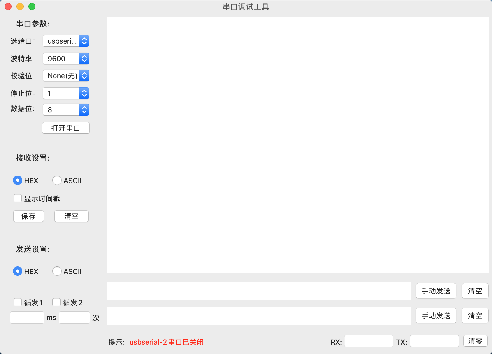

# SerialPort Tool for macOS

macOS串口工具功能：

1、支持RS485、RS232、RS422等串口通信。

2、支持HEX、ASCII编码。

3、支持根据串口配置信息，使用超时检测法，判断一包数据是否接收完成。

⚠️接收区：红色为接收码；橙色为发送码。

# 感谢：

https://github.com/billzbh/rs232-for-mac-os

https://github.com/armadsen/ORSSerialPort